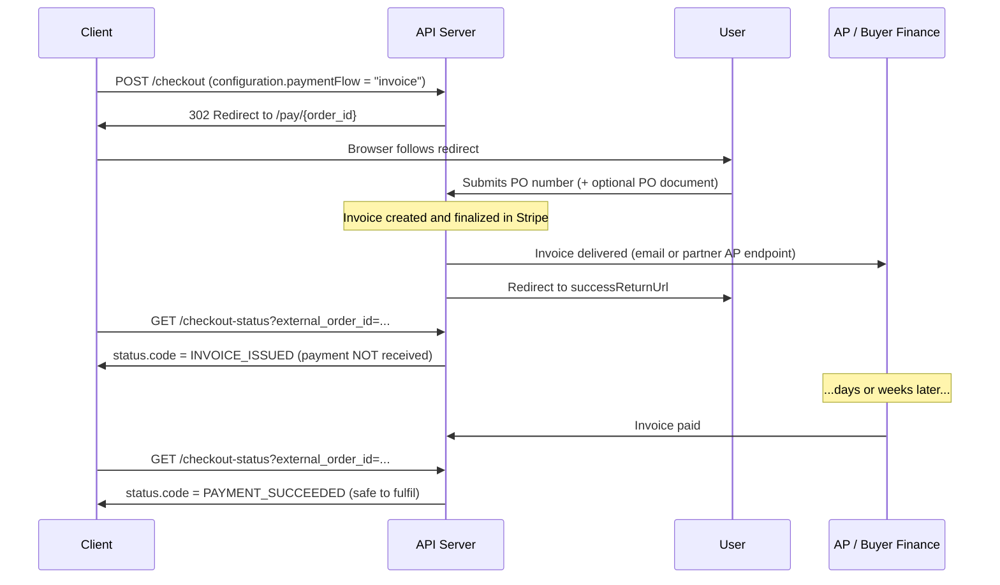

# Proposed API & Documentation Changes — Multi-Currency and PO/Invoice Orders

**Status:** Part A **applied** on branch `feature/multi-currency-spec` (except A.4 — see below).
Parts B and C remain a draft for review and approval.
**Author:** Engineering
**Date:** 2026-08-23 (Part A applied 2026-08-24)
**Scope:** Partner-facing contract changes in this repo (`api-specification.md`, `api-examples.md`,
`api_example_client.php`)
**Source of record:** `mor_checkout/docs/CURRENCY_AND_INVOICE_PROPOSAL.md` (design),
`mor_checkout/docs/PHASE_1_STATUS.md` (build state)

**Application status as of 2026-08-24.** Part A has been applied to this repo on the branch
`feature/multi-currency-spec`, alongside `mor_checkout` @ `feature/phase-1-multi-currency`, so the
docs and the code sit on paired branches and can be reviewed together.

| Part | State |
|---|---|
| A.1 request-parameter rows | Applied — both endpoints |
| A.2 Data Types and Formats | Applied |
| A.3 Supported Currencies subsection | Applied |
| A.4 `financials.currency` on `/checkout-status` | **Not applied.** It is a code change that has not been made; the field does not exist. Documenting it would publish an unbuilt contract. Land the code first, then apply A.4. |
| A.5 subdivision-code notices | Applied as banners on both endpoints |
| A.6 partner-enablement error | Applied — rewritten into this spec's `errors: [{field, code, message}]` shape rather than the raw Laravel `errors` map shown below |
| A.7 examples and sample client | Applied — explicit `"currency": "USD"` in all four example payloads, a full CAD checkout example, and a documented `'currency'` key in `api_example_client.php` |
| A.8 changelog | Applied as v1.4.0 with a placeholder date (`2026-XX-XX`) — needs the real release date |

Parts B and C below are unapplied. Each is written so that, once approved, it can be applied
mechanically.

---

## 1. Where the project actually stands

| Phase | Engineering state | Partner docs state |
|---|---|---|
| **Phase 1 — Multi-currency (USD/CAD/MXN)** | Code-complete, unit-tested, committed on `feature/phase-1-multi-currency`. Blocked on partner→currency mapping and CA/MX Stripe Tax registrations, not on code. | **Current** on `feature/multi-currency-spec` — Part A applied 2026-08-24. Was stale ("currently only US is supported", no `cartInformation.currency`). |
| **Phase 2 — Invoice issuance / PO capture** | Not started. Design only. Blocked on the redirect-semantics decision. | Not documented. |
| **Phase 3 — Invoice delivery** | Not started. Blocked on transactional email infrastructure (`MAIL_MAILER` is still `log`). | Not documented. |

The published spec in this repo has drifted behind the application's own
`mor_checkout/api-specification.md`, which was updated with the currency contract on 2026-08-16.
**Part A below is that drift.** Part B is genuinely new contract surface.

### Two things that are true today and are worth deciding on before either part ships

1. **`/checkout-status` does not return a currency.** It returns `financials.totalAmount: 228.73`
   with no indication of the unit. That was harmless when everything was USD. Once CAD and MXN are
   live it is ambiguous, and a partner reconciling AR has no way to resolve it from the response.
   Part A.4 proposes fixing this. It is additive.
2. **Phase 1 contains one backwards-incompatible change** — US `state` is now validated as an
   ISO 3166-2 subdivision code. `"California"` now returns 422 where it previously succeeded. This
   needs a partner notice ahead of the release, not just a changelog line (Part A.5).

---

## 2. Verification — is the PO flow indicated via the API today?

**No. There is no PO or invoice indicator anywhere in the shipped API.** Verified against both the
application and this repo:

| Checked | Result |
|---|---|
| `CheckoutRequest::rules()` | Accepts `configuration.externalOrderId`, `successReturnUrl`, `failureReturnUrl`, `allowUserDiscountCodes`. No `paymentFlow`, no PO field. Unknown keys are ignored, not rejected. |
| `Order` model | Statuses are `pending`, `pending_payment_confirmation`, `paid`, `completed`, `cancelled`, `failed`, `refunded`. No `awaiting_po` / `invoiced`. Columns: no `payment_flow`, `po_number`, `po_document_path`. |
| `getApiStatusCode()` | Emits 7 codes, none PO- or invoice-related. |
| Routes (`routes/web.php`) | `/pay/{publicId}` renders the Stripe Payment Element only. There is no upload route and no PO-capture mode. |
| This repo's spec and examples | Zero occurrences of "purchase order", "PO", `paymentFlow`, or `invoice` as a flow. |
| Webhooks | No `invoice.*` processors registered. |

The only place the flow exists is §3.2 of the internal proposal, as an unimplemented recommendation.

**Consequence for this review:** the conditional in the request ("verify PO flow is indicated via
API, then if so, form updates…") resolves to *not indicated*. So Part B proposes the API indicator
**and** the capture form together, because the form cannot be specified without first fixing how an
order is marked as an invoice order. If only one of the two is approved, approve the indicator —
the form is meaningless without it, but the indicator is independently useful for staged rollout.

---

# Part A — Multi-currency documentation changes

These describe behaviour that is already built. Approving this part is approving *publication*, not
new engineering — except A.4, which is a small additive code change and is **the one item not
applied** on this branch.

**Applied 2026-08-24**, except A.4. The subsections below are retained as the record of what was
changed and why.

### A.1 `POST /checkout` and `POST /calculate-tax-estimate` — request parameters

Add one row to both request-parameter tables (after `cartInformation` / before
`cartInformation.lineItems`):

```markdown
| cartInformation.currency | string | No | ISO 4217 currency code for all prices in this cart. One of "USD", "CAD", "MXN". Defaults to "USD" when omitted. Must be enabled for your partner account. |
```

Amend four existing rows in each table:

```markdown
| shippingAddress.state | string | Yes | ISO 3166-2 subdivision code for the country, without the country prefix (e.g. "NY", "ON", "JAL") |
| shippingAddress.country | string | Yes | ISO 3166-1 alpha-2 country code. One of "US", "CA", "MX" |
| billingAddress.state | string | Yes (if not sameAsShipping) | ISO 3166-2 subdivision code for the country, without the country prefix (e.g. "NY", "ON", "JAL") |
| billingAddress.country | string | Yes (if not sameAsShipping) | ISO 3166-1 alpha-2 country code. One of "US", "CA", "MX" |
```

### A.2 Data Types and Formats

Replace the two country/currency bullets with:

```markdown
- All country codes use ISO 3166-1 alpha-2 format ("US", "CA", "MX")
- All state/province values use ISO 3166-2 subdivision codes without the country prefix ("NY", not "New York"; "ON", not "Ontario"; "JAL", not "Jalisco")
- All currency codes use ISO 4217 format ("USD", "CAD", "MXN")
- Prices are always expressed in `cartInformation.currency`. No conversion is performed: the amount you send is the amount charged
- Currency is independent of the shipping and billing country. A Canadian shipping address paying in USD is valid
```

### A.3 New subsection — "Supported Currencies" (proposed, not in the internal spec)

The internal spec documents the field but never tells a partner what they get for each currency.
Partners will ask about payment methods, so state it. Suggested placement: under **Data Types and
Formats**.

```markdown
### Supported Currencies

| Currency | Code | Payment methods presented on the payment page |
|----------|------|-----------------------------------------------|
| US Dollar | USD | Card, ACH bank debit (`us_bank_account`) |
| Canadian Dollar | CAD | Card |
| Mexican Peso | MXN | Card |

Currencies are enabled per partner account. A request using a currency your account is not enabled
for is rejected with a 422. Contact support to have a currency enabled.

ACH bank debit is USD-only; it is not a general bank-transfer method. Asynchronous methods that
settle after the buyer leaves the payment page (OXXO, SPEI, ACSS/PAD) are not offered.
```

**Decision needed:** the payment-method table above is accurate to `config/currencies.php` today.
Publishing it makes it a commitment. The alternative is the vaguer "card payments are supported in
all currencies; ACH for USD". Recommend publishing the table — partners plan checkout UX around it.

### A.4 `/checkout-status` — return the currency *(this one is a code change)*

Add to the response-parameter table and both examples:

```markdown
| financials.currency | string | ISO 4217 currency code the amounts in this object are expressed in |
```

```json
"financials": {
  "currency": "CAD",
  "totalAmount": 228.73,
  "totalDiscount": 10.00,
  "totalTax": 8.75
}
```

Additive; no existing consumer breaks. Requires a one-line change in `CheckoutStatusController` and
its OpenAPI annotation. Roughly an hour including a test. **Recommend approving with Part A** — it
would be strange to ship three currencies and not say which one an order was in.

### A.5 Breaking change notice — US subdivision codes

Needs to go out to partners *before* release, and be called out prominently in the spec, not buried
in the changelog. Suggested banner under **Process Checkout → Request Parameters**:

```markdown
> **Change of behaviour (v1.4.0):** `state` is now validated as an ISO 3166-2 subdivision code for
> every supported country, including the US. Sending `"California"` instead of `"CA"` now returns a
> 422 validation error; previously it was accepted and produced a less accurate tax calculation.
> All examples in this document and all documented test fixtures already use 2-letter codes.
```

Also note in the spec that `/calculate-tax-estimate` now has the same `US`/`CA`/`MX` country
allowlist as checkout; it previously accepted any country string.

### A.6 New error case

Add to **Common Error Codes** / validation examples — the partner-enablement rejection, which is a
422 a correctly-formed request can still receive:

```json
{
  "message": "The given data was invalid.",
  "errors": {
    "cartInformation.currency": [
      "The selected cart information.currency is invalid: CAD is not enabled for this partner."
    ]
  }
}
```

### A.7 Examples and sample client

- `api-examples.md` — add a CAD checkout example alongside the existing USD one (currently four
  hardcoded `"country": "US"` blocks and no currency field anywhere).
- `api_example_client.php` — add `'currency' => 'USD'` to the sample cart explicitly, so the field
  is discoverable, and a commented CAD variant.

### A.8 Changelog entry

```markdown
| 2026-XX-XX | v1.4.0 | **Multi-Currency Support (USD/CAD/MXN)**<br/>• Added optional `cartInformation.currency` to `/checkout` and `/calculate-tax-estimate`, defaulting to `USD`<br/>• Shipping and billing `country` now accept `US`, `CA`, `MX`<br/>• **Breaking:** `state` is now validated as an ISO 3166-2 subdivision code for all countries, including the US<br/>• `/calculate-tax-estimate` now enforces the same country allowlist as `/checkout`<br/>• Added `financials.currency` to the `/checkout-status` response<br/>• Currencies are enabled per partner account; an unenabled currency returns 422<br/>• Prices are charged in the currency supplied — no conversion is performed |
```

---

# Part B — PO / Invoice orders

New contract surface. Everything here is a proposal; none of it exists.

### B.1 How an order is marked as a PO/invoice order

Add to `configuration` on `POST /checkout`:

```jsonc
{
  "configuration": {
    "externalOrderId": "ORD-2024-123456",
    "successReturnUrl": "https://example-partner.com/success",
    "failureReturnUrl": "https://example-partner.com/failure",

    "paymentFlow": "invoice",            // NEW — "card" (default) | "invoice"
    "purchaseOrderNumber": "PO-4471",    // NEW — optional; pre-fills the capture form
    "invoiceDueInDays": 30               // NEW — optional; defaults to your account setting
  }
}
```

Proposed spec rows:

```markdown
| configuration.paymentFlow | string | No | Payment flow for this order. `"card"` (default) collects payment immediately on the payment page. `"invoice"` collects a purchase order and issues an invoice payable later. `"invoice"` requires your partner account to be enabled for invoicing. |
| configuration.purchaseOrderNumber | string | No | Purchase order number, if you already hold it. Pre-fills the capture form; the buyer can correct it. Ignored when `paymentFlow` is `"card"`. |
| configuration.invoiceDueInDays | integer | No | Payment terms in days (1–90). Defaults to the value configured on your partner account. Ignored when `paymentFlow` is `"card"`. |
```

Rationale for putting the flow selector in `configuration` rather than `cartInformation`: currency
describes the cart, but the flow describes how *this checkout session* behaves — same category as
the return URLs. It also keeps `/calculate-tax-estimate`, which has no `configuration` block,
unaffected, which is correct: the tax estimate is identical either way.

**Rejected alternative:** inferring the flow from the presence of `purchaseOrderNumber`. It looks
tidier and it is a trap — a partner who has the PO number in hand for a *card* order would silently
be switched into a weeks-long AR flow. An explicit selector fails loudly instead.

### B.2 What the buyer sees, and where the redirect fires

```
POST /checkout (paymentFlow=invoice)
  └─ 302 → /pay/{orderId}   ← PO capture form, NOT the Payment Element
       └─ buyer submits PO number (+ optional PDF)
            └─ invoice issued (Stripe)
                 └─ 302 → successReturnUrl        ← fires HERE
   ...days or weeks later...
       └─ buyer pays the invoice → status becomes PAYMENT_SUCCEEDED
```

**This is the single most important thing to communicate, and the decision that gates
implementation.** For a card order the success redirect means *money received*. For an invoice
order it means *invoice issued* — payment may be weeks away or never arrive.

Recommended (and assumed below): **keep one redirect contract**, and require partners to branch on
status. `/checkout-status` returns `INVOICE_ISSUED` until `invoice.paid` arrives, then
`PAYMENT_SUCCEEDED`. Partners integrate once; the invoice case is a status they handle, not a second
integration. The alternative — a separate return URL for invoice orders — is semantically cleaner
but forces every invoicing partner into a second integration path.

**Approval required on this before Phase 2 implementation starts.** Owner: partner relationship.

Proposed spec banner:

```markdown
> **Do not fulfil on the redirect alone for invoice orders.** For `paymentFlow: "card"`, arrival at
> your `successReturnUrl` means payment has been taken. For `paymentFlow: "invoice"`, it means an
> invoice has been issued and payment is outstanding. Always call `/checkout-status` and branch on
> `status.code`: fulfil on `PAYMENT_SUCCEEDED`, hold on `INVOICE_ISSUED`.
```

**Sub-decision:** should the redirect carry the flow, e.g. `&payment_flow=invoice`, so the partner
can branch without a round trip? Recommend **yes as a hint only**, with an explicit warning that the
existing `nonce` covers `external_order_id + timestamp` and *not* this parameter — so it is not
tamper-evident and must never be the basis for fulfilment. If that caveat is judged too easy to
misread, omit the parameter and make `/checkout-status` the only answer.

### B.3 New status codes

```markdown
| AWAITING_PURCHASE_ORDER | Awaiting purchase order details from the buyer | Order status is `awaiting_po` — the buyer has been sent to the capture form but has not submitted it yet |
| INVOICE_ISSUED | An invoice has been issued and payment is outstanding | Order status is `invoiced` — the invoice has been finalized and delivered. Payment has **not** been received. Do not fulfil on this status alone |
| INVOICE_PAYMENT_FAILED | An attempted invoice payment failed | A payment attempt against the invoice was declined. The invoice remains open and payable |
```

The internal design also has a transient `po_received` state between submission and invoice
finalization (typically seconds, on a queue). **Recommend not exposing it** — a partner polling
during that window learns nothing actionable, and a code that exists only for a few seconds
generates support questions. Map it to `AWAITING_PURCHASE_ORDER` externally. Flagging it because it
is a deliberate divergence from §4.4 of the internal design.

`INVOICE_EXPIRED` / voided is left out of v1 deliberately: nothing in the design voids an invoice
automatically, and until the collections policy exists there is no correct semantic for it.

### B.4 `/checkout-status` additions for invoice orders

```markdown
| paymentFlow | string | `"card"` or `"invoice"` |
| purchaseOrder | object | Present for invoice orders only |
| purchaseOrder.number | string | Purchase order number captured from the buyer |
| purchaseOrder.documentReceived | boolean | Whether a PO document was uploaded |
| invoice | object | Present once an invoice has been issued |
| invoice.number | string | Invoice number |
| invoice.status | string | `open`, `paid`, `uncollectible`, or `void` |
| invoice.currency | string | ISO 4217 currency code |
| invoice.amountDue | number | Amount outstanding |
| invoice.amountPaid | number | Amount paid to date |
| invoice.dueAt | string | ISO 8601 due date |
| invoice.issuedAt | string | ISO 8601 issuance timestamp |
| invoice.paidAt | string\|null | ISO 8601 payment timestamp, null while outstanding |
| invoice.hostedUrl | string | Hosted invoice page where the buyer can view and pay |
| invoice.pdfUrl | string | Direct link to the invoice PDF |
```

```json
{
  "status": { "code": "INVOICE_ISSUED", "message": "An invoice has been issued and payment is outstanding" },
  "paymentFlow": "invoice",
  "purchaseOrder": { "number": "PO-4471", "documentReceived": true },
  "merchantOfRecord": { "customerId": "MOR-10042857", "transactionId": null, "orderId": "ORD-2023-03-17-001" },
  "financials": { "currency": "USD", "totalAmount": 228.73, "totalDiscount": 10.00, "totalTax": 8.75 },
  "invoice": {
    "number": "A1B2C3-0001", "status": "open", "currency": "USD",
    "amountDue": 228.73, "amountPaid": 0.00,
    "dueAt": "2026-09-22T00:00:00Z", "issuedAt": "2026-08-23T14:02:11Z", "paidAt": null,
    "hostedUrl": "https://invoice.stripe.com/i/acct_.../live_...",
    "pdfUrl": "https://pay.stripe.com/invoice/acct_.../pdf"
  }
}
```

**Two things to decide here.**

1. **`merchantOfRecord.transactionId` is null until the invoice is paid.** There is no PaymentIntent
   at issuance time. Partners currently receive a non-null string on every successful response.
   Explicitly document it as nullable, and confirm no partner integration treats it as required.
2. **`hostedUrl` and `pdfUrl` are unauthenticated bearer links** — anyone holding the URL can view
   and pay the invoice. Returning them to an authenticated partner over a signed request is
   defensible and operationally very useful (support and AR will both want them). Recommend
   including them, with the caveat documented. If that is not acceptable, omit both and have
   partners route buyers through support.

### B.5 New error cases

```json
{ "errors": { "configuration.paymentFlow": ["Invoicing is not enabled for this partner account."] } }
{ "errors": { "configuration.paymentFlow": ["The selected configuration.payment flow is invalid."] } }
{ "errors": { "configuration.invoiceDueInDays": ["The configuration.invoice due in days must be between 1 and 90."] } }
```

Plus a country restriction, if §6.1 of the internal proposal is accepted (see B.8):

```json
{ "errors": { "configuration.paymentFlow": ["Invoicing is not available for orders shipping to MX."] } }
```

### B.6 Flow diagram

The existing mermaid sequence diagram covers the card flow only. Proposed addition as a second
diagram rather than branching the existing one — the card path is the common case and should stay
readable:



### B.7 Changelog entry

```markdown
| 2026-XX-XX | v1.5.0 | **PO / Invoice Payment Flow**<br/>• Added `configuration.paymentFlow` (`"card"` default, `"invoice"`) to `/checkout`<br/>• Added optional `configuration.purchaseOrderNumber` and `configuration.invoiceDueInDays`<br/>• Invoice orders redirect the buyer to a purchase-order capture form instead of the Payment Element<br/>• **The success redirect for invoice orders means "invoice issued", not "payment received"** — branch on `status.code` before fulfilling<br/>• Added `AWAITING_PURCHASE_ORDER`, `INVOICE_ISSUED`, and `INVOICE_PAYMENT_FAILED` status codes<br/>• `/checkout-status` now returns `paymentFlow`, `purchaseOrder`, and `invoice` objects for invoice orders<br/>• `merchantOfRecord.transactionId` is null on invoice orders until payment is received<br/>• Invoicing is enabled per partner account |
```

### B.8 Scope restriction to confirm — Mexico

Engineering recommends **invoicing for US and CA only in v1; Mexico card-only**. Mexican B2B buyers
are legally entitled to a CFDI *factura* stamped by a SAT-certified PAC; Stripe does not issue CFDI,
and as merchant of record that obligation is ours. A Stripe invoice PDF is not a substitute for a
Mexican corporate buyer. Building it is a separate compliance project of comparable size to this
one.

If accepted, this needs a line in the spec, not just an internal note:

```markdown
The invoice payment flow is available for orders shipping to the US and Canada. Orders shipping to
Mexico must use `paymentFlow: "card"`.
```

Owner: legal/finance.

---

# Part C — The purchase-order capture form

Contingent on B.1 being approved. This is the buyer-facing form the `/pay/{orderId}` page renders
when `paymentFlow: "invoice"`, replacing the Stripe Payment Element for that order. Included here
because it is what the partner's buyer actually experiences, and because two of its fields are
driven by the API contract in Part B.

### C.1 Fields

| Field | Type | Required | Rules |
|---|---|---|---|
| Purchase order number | text | **Yes** | 1–64 chars, trimmed. Allow `A–Z a–z 0–9 - _ / .` and spaces. Pre-filled from `configuration.purchaseOrderNumber` and editable — the buyer is the authority on their own PO number. |
| Purchase order document | file | Configurable per partner; **optional by default** | Single file. `application/pdf`, `image/png`, `image/jpeg`. 5 MB hard cap. |
| Payment terms acknowledgement | checkbox | **Yes** | "I confirm this order will be invoiced, with payment due within N days." N from `invoiceDueInDays`. |

The order summary block (line items, subtotal, discount, tax, total) is reused unchanged from the
card page, including the currency-aware formatting built in Phase 1 — so this form is multi-currency
correct from day one at no extra cost. Submit button reads **"Submit purchase order"**, never "Pay".

**Deliberately excluded from v1:** an AP-destination email field on the form. Invoice delivery is
configured per partner (internal §4.4). A buyer-supplied destination is a plausible v2, but it turns
an unauthenticated public page into something that can direct where an invoice document is sent,
which needs its own thought.

### C.2 Upload handling

The `/pay/{orderId}` page is unauthenticated — the UUID *is* the bearer token. Adding a file upload
there is the largest new attack surface in this proposal, and the hardening is not optional:

- **Content sniffing**, not the client-supplied MIME type or the file extension. A `.pdf` that is
  really a PHP script must be rejected on its bytes.
- **5 MB cap enforced server-side**, independent of any client-side check.
- **Private storage disk.** Never a public URL, never a guessable path. Randomized stored filenames;
  the client-supplied filename is retained as a display attribute only and never used in a path.
- **Accepted only for orders in `awaiting_po`.** A submission against any other status is rejected —
  this also makes the form single-use and prevents re-submission after invoice issuance.
- **Rate limiting on the upload route.** The existing `RateLimitMiddleware` covers API routes, not
  web routes; this needs its own limiter keyed on order and IP.
- **CSRF protection** on the form POST.
- **AV scanning** — if it is a compliance requirement in this environment, it is a dependency to
  identify now, not during implementation. Please confirm either way.

### C.3 New routes

```
GET  /pay/{publicId}                       — existing; branches to PO capture when payment_flow=invoice
POST /pay/{publicId}/purchase-order        — NEW; accepts the form, transitions awaiting_po → po_received
GET  /pay/{publicId}/purchase-order/submitted — NEW; confirmation interstitial before the partner redirect
```

### C.4 De-scope option worth holding in reserve

If upload hardening or AV scanning turns out to be a longer pole than expected, **PO-number-only**
is a clean de-scope: drop the file field, keep everything else. The API contract in Part B is
unchanged by it, and `purchaseOrder.documentReceived` simply stays `false`. Worth stating now so it
stays available as a schedule lever rather than becoming a mid-flight redesign.

---

## 3. What needs a decision, and from whom

| # | Decision | Recommendation | Owner | Blocks |
|---|---|---|---|---|
| 1 | Publish Part A (currency docs) | Yes, when Phase 1 is committed and released | Engineering | Phase 1 release |
| 2 | Partner→currency mapping (which partners get CAD/MXN) | — | Partner relationship | Any non-USD order |
| 3 | CA/MX Stripe Tax registrations | — | Finance/tax | Any CA/MX order |
| 4 | Advance notice of the `state` subdivision change (A.5) | Send before release | Partner relationship | Phase 1 release |
| 5 | Add `financials.currency` to `/checkout-status` (A.4) | Yes | Engineering | — |
| 6 | Publish the per-currency payment-method table (A.3) | Yes | Product | — |
| 7 | **Redirect semantics for invoice orders (B.2)** | Single contract, branch on status | Partner relationship | **Phase 2 start** |
| 8 | Expose `paymentFlow` in the redirect query string (B.2) | Yes, as a non-authoritative hint | Engineering | — |
| 9 | Expose `invoice.hostedUrl` / `pdfUrl` (B.4) | Yes | Product/Security | — |
| 10 | `merchantOfRecord.transactionId` nullable on invoice orders (B.4) | Document as nullable | Partner relationship | — |
| 11 | Suppress the transient `po_received` status externally (B.3) | Yes | Engineering | — |
| 12 | **Mexico excluded from invoicing in v1 (B.8)** | Yes — MX card-only | Legal/finance | Phase 2 scope |
| 13 | PO document required or optional (C.1) | Optional by default, per-partner override | Product | Phase 2 |
| 14 | AV scanning required for uploads (C.2) | Confirm either way now | Security/compliance | Phase 2 |

Items 7 and 12 are the two that stop Phase 2 from starting. Items 2, 3 and 4 are the three that stop
Phase 1 — already-written code — from shipping.

## 4. If approved

1. Apply Part A to `api-specification.md`, `api-examples.md`, `api_example_client.php`; commit the
   Phase 1 work in the application repo; release together.
2. Send the subdivision-code notice (A.5) ahead of that release.
3. Resolve decisions 7 and 12, then apply Parts B and C to the spec as the Phase 2 contract, ahead of
   implementation, so partners can review the contract before it is built.
