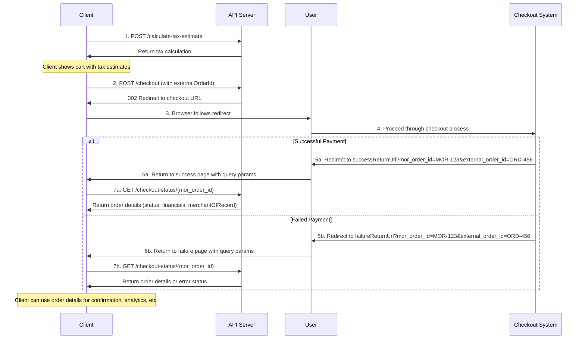

# API Technical Specification

## Table of Contents

1. [Overview](#overview)
2. [API Flow](#api-flow)
   - [Checkout Flow Diagram](#checkout-flow-diagram)
   - [Flow Description](#flow-description)
   - [Typical Implementation Example](#typical-implementation-example)
3. [Base URL](#base-url)
4. [Authentication](#authentication)
5. [Security](#security)
6. [API Endpoints](#api-endpoints)
   - [1. Process Checkout](#1-process-checkout)
   - [2. Calculate Tax Estimate](#2-calculate-tax-estimate)
   - [3. Checkout Status](#3-checkout-status)
7. [Error Handling](#error-handling)
   - [HTTP Status Codes](#http-status-codes)
   - [Error Response Format](#error-response-format)
   - [Common Error Codes](#common-error-codes)
8. [Rate Limiting](#rate-limiting)
9. [Versioning](#versioning)
10. [Data Types and Formats](#data-types-and-formats)
11. [Testing](#testing)
12. [Support and Contact Information](#support-and-contact-information)
13. [Changelog](#changelog)

## Overview
This document outlines the technical specifications for a payment processing API, which includes endpoints for checkout processing and tax calculation. The API follows RESTful principles and is designed to be secure, reliable, and efficient.

## API Flow

### Checkout Flow Diagram

The following diagram illustrates how the three endpoints interact in a typical checkout flow:



### Flow Description

1. **Tax Calculation**: The client first makes a POST request to `/calculate-tax-estimate` with the cart information to get accurate tax estimates.

2. **Initiate Checkout**: The client then makes a POST request to `/checkout` with the same information, including a required `externalOrderId`. If successful, the API returns a 302 redirect response with the checkout URL in the Location header.

3. **Redirect User**: The browser automatically follows the 302 redirect to the checkout URL where the user will complete the payment process.

4. **Checkout Process**: The user proceeds through the checkout process hosted by the payment system.

5. **Completion and Return**: 
   - If the payment is successful, the user is redirected to the `successReturnUrl` with query parameters: `mor_order_id` and `external_order_id`
   - If the payment fails, the user is redirected to the `failureReturnUrl` with the same query parameters

6. **Order Status Retrieval**: The client can use the `mor_order_id` from the redirect to call the `/checkout-status/{mor_order_id}` endpoint to retrieve detailed transaction information, including merchant of record details and financial totals.

This flow allows the client application to:
- Get accurate tax estimates before initiating checkout
- Provide a seamless handoff to the payment system
- Handle both successful and failed payment scenarios
- Return users to the appropriate page with order identifiers
- Retrieve complete order details for confirmation, analytics, or record-keeping

### Typical Implementation Example

```javascript
// Example client-side implementation
async function processCheckout(cartData) {
  try {
    // Step 1: Calculate taxes
    const timestamp = new Date().toISOString().replace(/\.\d{3}Z$/, 'Z');
    const taxEstimateResponse = await fetch('https://api.example.com/api/v1/calculate-tax-estimate', {
      method: 'POST',
      headers: {
        'Content-Type': 'application/json',
        'X-SPT-MOR-Signature': generateSignature(cartData, timestamp, SIGNING_KEY),
        'X-SPT-MOR-Domain': 'your-partner-domain.com',
        'X-SPT-MOR-Timestamp': timestamp
      },
      body: JSON.stringify(cartData)
    });
    
    const taxEstimate = await taxEstimateResponse.json();
    
    // Display tax estimates to the user
    updateCartDisplay(taxEstimate);
    
    // Step 2: If user confirms, proceed with checkout
    if (userConfirmsCheckout()) {
      const checkoutTimestamp = new Date().toISOString().replace(/\.\d{3}Z$/, 'Z');
      const checkoutResponse = await fetch('https://api.example.com/api/v1/checkout', {
        method: 'POST',
        headers: {
          'Content-Type': 'application/json',
          'X-SPT-MOR-Signature': generateSignature(cartData, checkoutTimestamp, SIGNING_KEY),
          'X-SPT-MOR-Domain': 'your-partner-domain.com',
          'X-SPT-MOR-Timestamp': checkoutTimestamp
        },
        body: JSON.stringify(cartData),
        redirect: 'manual' // Prevent automatic redirect to handle it manually
      });
      
      // Step 3: Handle the 302 redirect response
      if (checkoutResponse.status === 302) {
        const checkoutUrl = checkoutResponse.headers.get('Location');
        window.location.href = checkoutUrl;
      } else if (!checkoutResponse.ok) {
        const errorData = await checkoutResponse.json();
        displayError(errorData.errors || { message: 'Checkout failed' });
      }
    }
  } catch (error) {
    console.error('Checkout process failed:', error);
    displayError({ message: 'An unexpected error occurred during checkout.' });
  }
}

// Helper function to generate HMAC-SHA256 signature
function generateSignature(data, timestamp, key) {
  const jsonString = JSON.stringify(data);
  const dataToSign = jsonString + timestamp;
  // In a real implementation, create an HMAC-SHA256 hash of the concatenated string using the key
  return hmacSha256(dataToSign, key);
}
```

After the checkout process completes, the user will be redirected to one of the URLs specified in the `configuration` object:
- `successReturnUrl`: If payment was successful
- `failureReturnUrl`: If payment failed

The client application should be prepared to handle both scenarios, typically by checking for status parameters in the redirect URL.

## Base URL
```
https://<domain>/api/v1/
```

## Authentication
All API requests require authentication using three required headers:

### Required Headers

| Header | Required | Description |
|--------|----------|-------------|
| `X-SPT-MOR-Signature` | Yes | HMAC-SHA256 signature of the request body + timestamp |
| `X-SPT-MOR-Domain` | Yes | Partner domain for identification |
| `X-SPT-MOR-Timestamp` | Yes | UTC timestamp in ISO 8601 format |

### Creating the Signature
1. Take the entire request body as a JSON string
2. Get the current UTC timestamp in ISO 8601 format (e.g., `2025-06-17T17:22:00Z`)
3. Concatenate the request body string with the timestamp string
4. Create an HMAC-SHA256 hash of this concatenated string using your provided signing key
5. Include the signature, domain, and timestamp in the respective headers

Example (using pseudo-code):
```
requestBody = JSON.stringify(requestData);
timestamp = getCurrentUTCTimestamp(); // Format: YYYY-MM-DDTHH:MM:SSZ
dataToSign = requestBody + timestamp;
signature = HMAC-SHA256(dataToSign, signingKey);

headers['X-SPT-MOR-Signature'] = signature;
headers['X-SPT-MOR-Domain'] = 'your-partner-domain.com';
headers['X-SPT-MOR-Timestamp'] = timestamp;
```

### Timestamp Requirements
- Must be in UTC timezone
- Must use ISO 8601 format: `YYYY-MM-DDTHH:MM:SSZ`
- Must be within 5 minutes of the current server time
- Examples of valid timestamps:
  - `2025-06-17T17:22:00Z`
  - `2025-12-31T23:59:59Z`
  - `2025-01-01T00:00:00Z`

### Domain Authentication
The `X-SPT-MOR-Domain` header must contain your assigned partner domain. This domain is used to identify your organization and retrieve the correct signing key for signature verification.

## Security
- All API requests must use HTTPS/SSL protocol
- TLS 1.2 or higher is required
- Request data is encrypted in transit
- API keys should be stored securely and never exposed in client-side code
- All three authentication headers (`X-SPT-MOR-Signature`, `X-SPT-MOR-Domain`, `X-SPT-MOR-Timestamp`) are required
- Timestamps must be within 5 minutes of server time to prevent replay attacks
- Signatures include both request body and timestamp for enhanced security
- Requests without proper authentication will receive a 401 Unauthorized response

## API Endpoints

### 1. Process Checkout

**Endpoint:** `/checkout`  
**Method:** `POST`  
**Content-Type:** `application/json`

This endpoint processes checkout operations, including payment processing and order creation.

#### Request Parameters

| Field | Type | Required | Description |
|-------|------|----------|-------------|
| cartInformation | object | Yes | Information about cart contents |
| cartInformation.lineItems | array | Yes | Array of items in the cart |
| cartInformation.lineItems[].sku | string | Yes | Product SKU identifier |
| cartInformation.lineItems[].price | number | Yes | Price per unit |
| cartInformation.lineItems[].quantity | integer | Yes | Quantity of the product |
| cartInformation.lineItems[].description | string | Yes | Product description |
| cartInformation.lineItems[].discounts | array | No | Discounts applied to the specific item |
| cartInformation.lineItems[].discounts[].discountId | string | Yes | Unique discount identifier |
| cartInformation.lineItems[].discounts[].description | string | Yes | Description of the discount |
| cartInformation.lineItems[].discounts[].type | string | Yes | Type of discount (e.g., "percentage", "fixed") |
| cartInformation.lineItems[].discounts[].value | number | Yes | Discount value (percentage or fixed amount) |
| orderDiscounts | array | No | Discounts applied to the entire order |
| orderDiscounts[].discountId | string | Yes | Unique discount identifier |
| orderDiscounts[].description | string | Yes | Description of the discount |
| orderDiscounts[].type | string | Yes | Type of discount (e.g., "percentage", "fixed") |
| orderDiscounts[].value | number | Yes | Discount value (percentage or fixed amount) |
| shippingAddress | object | Yes | Shipping address information |
| shippingAddress.firstName | string | Yes | First name for shipping |
| shippingAddress.lastName | string | Yes | Last name for shipping |
| shippingAddress.addressLine1 | string | Yes | Primary street address |
| shippingAddress.addressLine2 | string | No | Secondary address information (apt, suite, etc.) |
| shippingAddress.city | string | Yes | City |
| shippingAddress.state | string | Yes | State or province |
| shippingAddress.postalCode | string | Yes | ZIP or postal code |
| shippingAddress.country | string | Yes | Country |
| shippingAddress.phone | string | Yes | Phone number |
| billingAddress | object | Yes | Billing address information |
| billingAddress.sameAsShipping | boolean | No | Whether billing address is the same as shipping |
| billingAddress.firstName | string | Yes (if not sameAsShipping) | First name for billing |
| billingAddress.lastName | string | Yes (if not sameAsShipping) | Last name for billing |
| billingAddress.addressLine1 | string | Yes (if not sameAsShipping) | Primary street address |
| billingAddress.addressLine2 | string | No | Secondary address information (apt, suite, etc.) |
| billingAddress.city | string | Yes (if not sameAsShipping) | City |
| billingAddress.state | string | Yes (if not sameAsShipping) | State or province |
| billingAddress.postalCode | string | Yes (if not sameAsShipping) | ZIP or postal code |
| billingAddress.country | string | Yes (if not sameAsShipping) | Country |
| billingAddress.phone | string | Yes (if not sameAsShipping) | Phone number |
| email | string | Yes | Customer email address |
| renewal | object | No | Information for renewal purchases |
| renewal.originalPurchaseDate | string | Yes (if renewal) | Date of original purchase (YYYY-MM-DD) |
| renewal.originalTransactionId | string | Yes (if renewal) | Transaction ID of original purchase |
| existingClientId | string | No | Client ID if customer already exists in system |
| configuration | object | Yes | Additional checkout configuration |
| configuration.successReturnUrl | string | Yes | URL to redirect after successful checkout |
| configuration.failureReturnUrl | string | Yes | URL to redirect after failed checkout |
| configuration.allowUserDiscountCodes | boolean | No | Whether to allow user-entered discount codes |
| configuration.externalOrderId | string | Yes | External order identifier for partner reference |

#### Example Request
```json
{
  "cartInformation": {
    "lineItems": [
      {
        "sku": "PROD-123",
        "price": 199.99,
        "quantity": 2,
        "description": "1 Year Annual License",
        "discounts": [
          {
            "discountId": "ITEM-10OFF",
            "description": "10% off",
            "type": "percentage",
            "value": 10
          }
        ]
      },
      {
        "sku": "PROD-456",
        "price": 29.99,
        "quantity": 1,
        "description": "1 Year Support",
        "discounts": []
      }
    ]
  },
  "orderDiscounts": [
    {
      "discountId": "GOODCUSTOMER",
      "description": "$100 Off Entire Order",
      "type": "fixed",
      "value": 100.00
    }
  ],
  "shippingAddress": {
    "firstName": "John",
    "lastName": "Doe",
    "addressLine1": "123 Main Street",
    "addressLine2": "Apt 4B",
    "city": "Boston",
    "state": "MA",
    "postalCode": "02108",
    "country": "USA",
    "phone": "555-123-4567"
  },
  "billingAddress": {
    "sameAsShipping": true,
    "firstName": "John",
    "lastName": "Doe",
    "addressLine1": "123 Main Street",
    "addressLine2": "Apt 4B",
    "city": "Boston",
    "state": "MA", 
    "postalCode": "02108",
    "country": "USA",
    "phone": "555-123-4567"
  },
  "email": "john.doe@example.com",
  "renewal": {
    "originalPurchaseDate": "2024-03-17",
    "originalTransactionId": "xxxxxxxxxxx1234"
  },
  "existingClientId": "CID-98765",
  "configuration": {
    "successReturnUrl": "https://example-partner.com/checkout/success",
    "failureReturnUrl": "https://example-partner.com/checkout/failure",
    "allowUserDiscountCodes": true,
    "externalOrderId": "ORD-2024-123456"
  }
}
```

#### Response

Upon successful processing, the API will return a **302 Found** status code with a `Location` header containing the checkout page URL. The client should redirect the user to this URL to complete the checkout process.

**Response Status:** `302 Found`  
**Response Header:** `Location: https://checkout.example.com/session/abc123xyz`

The user will be redirected to the hosted checkout page where they can complete their payment. After the checkout process is completed:
- If payment is successful, the user will be redirected to the `successReturnUrl` specified in the request with the following query string parameters appended:
  - `mor_order_id`: The unique order identifier from the MOR system
  - `external_order_id`: The external order identifier provided in the request
  - Any other query string parameters originally included in the success URL will be preserved
- If payment fails or is cancelled, the user will be redirected to the `failureReturnUrl` specified in the request with the same query string parameters appended

**Example redirect URLs after checkout:**
- Success: `https://example-partner.com/checkout/success?mor_order_id=MOR-123456&external_order_id=ORD-2024-123456&existing_param=value`
- Failure: `https://example-partner.com/checkout/failure?mor_order_id=MOR-123456&external_order_id=ORD-2024-123456&existing_param=value`

### 2. Calculate Tax Estimate

**Endpoint:** `/calculate-tax-estimate`  
**Method:** `POST`  
**Content-Type:** `application/json`

This endpoint calculates tax estimates for a given set of items and location.

#### Request Parameters

The request parameters for the tax estimation endpoint are identical to the checkout endpoint. This ensures consistency and allows for tax estimation before finalizing the checkout.

| Field | Type | Required | Description |
|-------|------|----------|-------------|
| cartInformation | object | Yes | Information about cart contents |
| cartInformation.lineItems | array | Yes | Array of items in the cart |
| cartInformation.lineItems[].sku | string | Yes | Product SKU identifier |
| cartInformation.lineItems[].price | number | Yes | Price per unit |
| cartInformation.lineItems[].quantity | integer | Yes | Quantity of the product |
| cartInformation.lineItems[].description | string | Yes | Product description |
| cartInformation.lineItems[].discounts | array | No | Discounts applied to the specific item |
| cartInformation.lineItems[].discounts[].discountId | string | Yes | Unique discount identifier |
| cartInformation.lineItems[].discounts[].description | string | Yes | Description of the discount |
| cartInformation.lineItems[].discounts[].type | string | Yes | Type of discount (e.g., "percentage", "fixed") |
| cartInformation.lineItems[].discounts[].value | number | Yes | Discount value (percentage or fixed amount) |
| orderDiscounts | array | No | Discounts applied to the entire order |
| orderDiscounts[].discountId | string | Yes | Unique discount identifier |
| orderDiscounts[].description | string | Yes | Description of the discount |
| orderDiscounts[].type | string | Yes | Type of discount (e.g., "percentage", "fixed") |
| orderDiscounts[].value | number | Yes | Discount value (percentage or fixed amount) |
| shippingAddress | object | Yes | Shipping address information |
| shippingAddress.firstName | string | Yes | First name for shipping |
| shippingAddress.lastName | string | Yes | Last name for shipping |
| shippingAddress.addressLine1 | string | Yes | Primary street address |
| shippingAddress.addressLine2 | string | No | Secondary address information (apt, suite, etc.) |
| shippingAddress.city | string | Yes | City |
| shippingAddress.state | string | Yes | State or province |
| shippingAddress.postalCode | string | Yes | ZIP or postal code |
| shippingAddress.country | string | Yes | Country |
| shippingAddress.phone | string | Yes | Phone number |
| billingAddress | object | Yes | Billing address information |
| billingAddress.sameAsShipping | boolean | No | Whether billing address is the same as shipping |
| billingAddress.firstName | string | Yes (if not sameAsShipping) | First name for billing |
| billingAddress.lastName | string | Yes (if not sameAsShipping) | Last name for billing |
| billingAddress.addressLine1 | string | Yes (if not sameAsShipping) | Primary street address |
| billingAddress.addressLine2 | string | No | Secondary address information (apt, suite, etc.) |
| billingAddress.city | string | Yes (if not sameAsShipping) | City |
| billingAddress.state | string | Yes (if not sameAsShipping) | State or province |
| billingAddress.postalCode | string | Yes (if not sameAsShipping) | ZIP or postal code |
| billingAddress.country | string | Yes (if not sameAsShipping) | Country |
| billingAddress.phone | string | Yes (if not sameAsShipping) | Phone number |
| email | string | Yes | Customer email address |
| renewal | object | No | Information for renewal purchases |
| renewal.originalPurchaseDate | string | Yes (if renewal) | Date of original purchase (YYYY-MM-DD) |
| renewal.originalTransactionId | string | Yes (if renewal) | Transaction ID of original purchase |
| existingClientId | string | No | Client ID if customer already exists in system |
| configuration | object | Yes | Additional checkout configuration |
| configuration.successReturnUrl | string | Yes | URL to redirect after successful checkout |
| configuration.failureReturnUrl | string | Yes | URL to redirect after failed checkout |

#### Example Request
```json
{
  "cartInformation": {
    "lineItems": [
      {
        "sku": "PROD-123",
        "price": 199.99,
        "quantity": 2,
        "description": "1 Year Annual License",
        "discounts": [
          {
            "discountId": "ITEM-10OFF",
            "description": "10% off",
            "type": "percentage",
            "value": 10
          }
        ]
      },
      {
        "sku": "PROD-456",
        "price": 29.99,
        "quantity": 1,
        "description": "1 Year Support",
        "discounts": []
      }
    ]
  },
  "orderDiscounts": [
    {
      "discountId": "GOODCUSTOMER",
      "description": "$100 Off Entire Order",
      "type": "fixed",
      "value": 100.00
    }
  ],
  "shippingAddress": {
    "firstName": "John",
    "lastName": "Doe",
    "addressLine1": "123 Main Street",
    "addressLine2": "Apt 4B",
    "city": "Boston",
    "state": "MA",
    "postalCode": "02108",
    "country": "USA",
    "phone": "555-123-4567"
  },
  "billingAddress": {
    "sameAsShipping": true,
    "firstName": "John",
    "lastName": "Doe",
    "addressLine1": "123 Main Street",
    "addressLine2": "Apt 4B",
    "city": "Boston",
    "state": "MA", 
    "postalCode": "02108",
    "country": "USA",
    "phone": "555-123-4567"
  },
  "email": "john.doe@example.com",
  "renewal": {
    "originalPurchaseDate": "2024-03-17",
    "originalTransactionId": "xxxxxxxxxxx1234"
  },
  "existingClientId": "CID-98765",
  "configuration": {
    "successReturnUrl": "https://example-partner.com/checkout/success",
    "failureReturnUrl": "https://example-partner.com/checkout/failure"
  }
}
```

#### Response Parameters

| Field | Type | Description |
|-------|------|-------------|
| financials | object | Financial details including tax information |
| financials.totalTaxCharged | number | Total tax amount |
| financials.lineItemTotals | array | Financial details for each line item |
| financials.lineItemTotals[].sku | string | Product SKU |
| financials.lineItemTotals[].subtotal | number | Subtotal for this line item |
| financials.lineItemTotals[].tax | number | Tax amount for this line item |
| financials.lineItemTotals[].discount | number | Discount amount for this line item |
| financials.lineItemTotals[].total | number | Total amount for this line item (including tax, after discounts) |

#### Example Response
```json
{
   "financials": {
    "totalTaxCharged": 8.75,
    "lineItemTotals": [
      {
        "sku": "PROD-123",
        "subtotal": 199.99,
        "tax": 5.00,
        "discount": 10.00,
        "total": 194.99
      },
      {
        "sku": "PROD-456",
        "subtotal": 29.99,
        "tax": 3.75,
        "discount": 0.00,
        "total": 33.74
      }
    ]
  }
}
```

### 3. Checkout Status

**Endpoint:** `/checkout-status/<mor_order_id>`  
**Method:** `GET`  
**Content-Type:** `application/json`

This endpoint retrieves the status and details of a checkout transaction using the MOR order ID. This endpoint requires the same authentication headers as all other endpoints (`X-SPT-MOR-Signature`, `X-SPT-MOR-Domain`, and `X-SPT-MOR-Timestamp`).

#### Request Parameters

The `mor_order_id` is provided as a URL parameter. No request body is required.

**URL Parameter:**
- `mor_order_id` (string, required): The unique order identifier from the MOR system

**Authentication Note:** For this GET request, the signature should be calculated using the `external_order_id` from the original checkout request instead of a request body. The signature is created by concatenating the external_order_id with the timestamp: `HMAC-SHA256(external_order_id + timestamp, signingKey)`.

#### Example Request
```
GET /checkout-status/MOR-123456
```

#### Response Parameters

| Field | Type | Description |
|-------|------|-------------|
| status | object | Status information for the checkout |
| status.code | string | Status code (e.g., "PAYMENT_SUCCEEDED") |
| status.message | string | Human-readable status message |
| merchantOfRecord | object | Merchant of record information |
| merchantOfRecord.customerId | string | Unique customer identifier in MOR system |
| merchantOfRecord.transactionId | string | Unique transaction identifier |
| merchantOfRecord.orderId | string | Unique order identifier |
| financials | object | Financial details of the transaction |
| financials.totalAmount | number | Total amount charged |
| financials.totalDiscount | number | Total discount amount applied |
| financials.totalTax | number | Total tax amount charged |
| error | object | Only present if an error occurred |
| error.code | string | Error code |
| error.message | string | Error message |

#### Example Response (Success)
```json
{
  "status": {
    "code": "PAYMENT_SUCCEEDED",
    "message": "Payment was processed successfully"
  },
  "merchantOfRecord": {
    "customerId": "MOR-10042857",
    "transactionId": "TXN-98765432",
    "orderId": "ORD-2023-03-17-001"
  },
  "financials": {
    "totalAmount": 228.73,
    "totalDiscount": 10.00,
    "totalTax": 8.75
  }
}
```

#### Example Response (Error)
```json
{
  "error": {
    "code": "CHECKOUT_ABANDONED",
    "message": "The checkout process was abandoned by the user"
  }
}
```

## Error Handling

### HTTP Status Codes

| Status Code | Description |
|-------------|-------------|
| 200 | OK - The request was successful |
| 400 | Bad Request - The request was invalid or cannot be processed |
| 401 | Unauthorized - Authentication failed or was not provided |
| 403 | Forbidden - The authenticated user does not have permission |
| 404 | Not Found - The requested resource does not exist |
| 422 | Unprocessable Entity - The request was well-formed but cannot be processed |
| 429 | Too Many Requests - Rate limit exceeded |
| 500 | Internal Server Error - An error occurred on the server |
| 503 | Service Unavailable - The service is temporarily unavailable |

### Error Response Format

API error responses follow this format:

```json
{
  "status": {
    "code": "ERROR_CODE",
    "message": "Human-readable error message"
  },
  "errors": [
    {
      "field": "fieldName",
      "code": "FIELD_ERROR_CODE",
      "message": "Specific field error message"
    }
  ],
  "requestId": "req-uuid-1234-5678-abcd"
}
```

The response includes:
- `status`: Contains the main error code and a general message
- `errors`: An array of specific validation errors (included only for request validation errors)
- `requestId`: A unique identifier for the request that can be used when contacting support

### Common Error Codes

| Error Code | Description |
|------------|-------------|
| UNAUTHORIZED | Authentication failed - missing or invalid headers |
| INVALID_REQUEST | The request format is invalid or missing required fields |
| PAYMENT_FAILED | The payment could not be processed |
| PAYMENT_CANCELLED | The user cancelled the payment process |
| TAX_CALCULATION_ERROR | Unable to calculate taxes for the given items/address |
| INVALID_DISCOUNT | The discount code is invalid or expired |
| INTERNAL_ERROR | An unexpected error occurred on the server |

### Authentication Error Messages

| Error Message | Description |
|---------------|-------------|
| Missing X-SPT-MOR-Signature header | The required signature header was not provided |
| Missing X-SPT-MOR-Domain header | The required domain header was not provided |
| Missing X-SPT-MOR-Timestamp header | The required timestamp header was not provided |
| Invalid signature | The provided signature does not match the expected value |
| Invalid timestamp format. Expected ISO 8601 UTC format (e.g., 2025-06-17T17:22:00Z) | The timestamp format is incorrect |
| Request timestamp is too old. Timestamp must be within 5 minutes of current time | The timestamp is outside the allowed time window |

#### Field-Specific Error Codes

| Error Code | Description |
|------------|-------------|
| REQUIRED_FIELD | A required field is missing |
| INVALID_FORMAT | The field format is invalid |
| INVALID_VALUE | The field value is invalid |
| OUT_OF_RANGE | The field value is outside of acceptable range |

#### Example Authentication Error Response
```json
{
  "status": {
    "code": "UNAUTHORIZED",
    "message": "Missing X-SPT-MOR-Timestamp header"
  },
  "requestId": "req-abc123-def456-ghi789"
}
```

#### Example Payment Error Response
```json
{
  "status": {
    "code": "PAYMENT_FAILED",
    "message": "The payment could not be processed. Please try again or use a different payment method."
  },
  "requestId": "req-7891011-abcd-efgh-1234"
}
```

#### Example Validation Error Response
```json
{
  "status": {
    "code": "INVALID_REQUEST",
    "message": "The request contains validation errors."
  },
  "errors": [
    {
      "field": "shippingAddress.postalCode",
      "code": "INVALID_FORMAT",
      "message": "The postal code format is invalid for the specified country."
    },
    {
      "field": "email",
      "code": "INVALID_FORMAT",
      "message": "Please provide a valid email address."
    }
  ],
  "requestId": "req-1234567-abcd-efgh-5678"
}
```

## Rate Limiting

To ensure the stability and performance of the API, rate limits are applied:

- Standard tier: 100 requests per minute
- Premium tier: 500 requests per minute

When the rate limit is exceeded, the API will return a 429 status code with headers indicating the rate limit and when it will reset:

```
X-RateLimit-Limit: 100
X-RateLimit-Remaining: 0
X-RateLimit-Reset: 1616973392
```

## Versioning

The API uses versioning in the URL path (e.g., `/v1/checkout`). When breaking changes are introduced, a new version will be released.

- All existing versions will be supported for at least 12 months after a new version is released
- Deprecation notices will be communicated at least 3 months before a version is retired

## Data Types and Formats

- All dates and times are in ISO 8601 format (e.g., `2025-03-27T14:30:00Z`)
- All monetary amounts are decimal numbers with up to 2 decimal places
- All country codes use ISO 3166-1 alpha-2 format
- All currency codes use ISO 4217 format

## Testing

A sandbox environment is available for testing:

```
https://sandbox-morcheckout.standardpartstoolkit.com/api/
```

Test API keys and signing keys will be provided for sandbox use.

## Changelog

| Date | Version | Description |
|------|---------|-------------|
| 2025-08-05 | v1.3.0 | **Checkout Status Endpoint and Enhanced Checkout Flow**<br/>• Added new `/checkout-status/<mor_order_id>` endpoint for retrieving transaction details<br/>• Added required `configuration.externalOrderId` field to `/checkout` endpoint<br/>• Updated checkout redirect behavior to include `mor_order_id` and `external_order_id` query parameters in success/failure URLs<br/>• Checkout status endpoint returns merchant of record IDs (customerId, transactionId, orderId) and financial totals<br/>• Checkout status endpoint uses `external_order_id + timestamp` for signature authentication instead of empty body<br/>• Updated all example URLs to use `example-partner.com` for consistency<br/>• Returns 404 for non-existent orders, 200 with error object for incomplete payments |
| 2025-07-08 | v1.2.0 | **Checkout Endpoint Response Update**<br/>• Changed `/checkout` endpoint to return HTTP 302 redirect instead of JSON response<br/>• Response now includes `Location` header with checkout page URL<br/>• Clients should follow the redirect to complete checkout process<br/>• Updated documentation and examples to reflect new redirect behavior |
| 2025-06-23 | v1.1.0 | **Enhanced Authentication System**<br/>• Added required `X-SPT-MOR-Domain` header for partner identification<br/>• Added required `X-SPT-MOR-Timestamp` header with 5-minute window validation<br/>• Updated signature calculation to include timestamp (requestBody + timestamp)<br/>• Enhanced security with replay attack protection<br/>• Improved authentication error messages and documentation |
| 2025-03-27 | v1.0.0 | Initial release |
